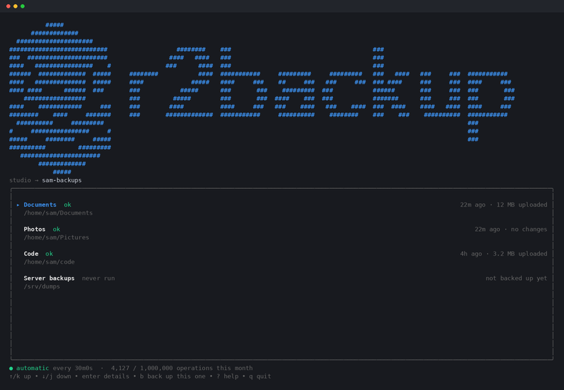

<div align="center">

<picture>
  <source media="(prefers-color-scheme: dark)" srcset="assets/logo-dark.png">
  
</picture>

**Back up your folders to Cloudflare R2, and get them back anywhere.**

[](https://github.com/saurabhhbansal/r2backup/releases/latest)
[](https://github.com/saurabhhbansal/r2backup/actions)
[](LICENSE)

</div>

---

## Install

**Windows** — PowerShell

```powershell
irm https://github.com/saurabhhbansal/r2backup/releases/latest/download/install.ps1 | iex
```

**macOS / Linux**

```sh
curl -sSL https://github.com/saurabhhbansal/r2backup/releases/latest/download/install.sh | sh
```

One static binary, no runtime to install and nothing left running in the
background. Both scripts check the download against the published checksums.
The command is `r2b`.

## Start

You need a Cloudflare R2 bucket and an S3 API token for it — Cloudflare
dashboard → R2 → Manage API tokens.

```sh
r2b setup              # sign in and store your keys
r2b add ~/Documents    # choose what goes in, then it backs up and schedules itself
r2b                    # open the dashboard
```

`add` shows the folder as a tree with everything ticked. Untick what you do
not want, press enter, and it takes care of the rest — including offering to
run every 30 minutes from then on.

<div align="center">
<br>

</div>

## Use it

Run `r2b` on its own and everything is there — signing in, adding a folder,
restoring, scheduling. There is nothing you have to drop back to the command
line for, and that is a test rather than a claim: every command and every flag
has a key, and the build fails if one is added without.

Four modes, on <kbd>1</kbd>–<kbd>4</kbd> or <kbd>tab</kbd>:

| mode | |
|---|---|
| **Folders** | what is backed up, and what each run did |
| **Schedule** | whether backups run by themselves, how often, and when next |
| **Trash** | what is recoverable, and until when |
| **Account** | your R2 keys, signing in, and your other computers |

| key | |
|---|---|
| <kbd>a</kbd> | add a folder — browse to it, then tick what goes in |
| <kbd>b</kbd> <kbd>B</kbd> | back up this folder · back up all of them |
| <kbd>e</kbd> <kbd>r</kbd> | change what is included · restore |
| <kbd>f</kbd> <kbd>c</kbd> | what is stored, with sizes · every backup in the bucket |
| <kbd>n</kbd> <kbd>m</kbd> | rename · point at a folder that moved |
| <kbd>x</kbd> <kbd>X</kbd> | stop backing a folder up · stop and delete the stored copy |
| <kbd>?</kbd> | every key |

Every command also still works on its own, unchanged — which is what the
scheduler and your scripts use.

| command | |
|---|---|
| `r2b setup` | Get this computer ready. `--keys` to re-enter your R2 keys |
| `r2b add <folder>` | Choose what to include, then back it up |
| `r2b edit <set>` | Change what a folder includes |
| `r2b backup [set]` | Back up now — all folders, or one |
| `r2b restore <set>` | Bring a folder back. `--to`, `--only`, `--verify`, `--deleted`, `--machine` |
| `r2b status` | What ran, when, and what is next. `--watch` follows a run |
| `r2b ls [set]` | What is stored |
| `r2b trash ls [set]` | What is recoverable, and until when |
| `r2b schedule` | Automatic runs. `--every`, `--remove`, `--repair` |
| `r2b rename` · `r2b relink` | Rename a set · point one at a folder that moved |
| `r2b remove <set>` | Stop backing a folder up. `--purge` deletes the copy too |
| `r2b account` | The computers signed in. `devices`, `logout` |
| `r2b update` | Update to the latest release |

## What it does

**Mirrors, not snapshots.** The bucket holds your folder as it is now, one
object per file, browsable in the R2 dashboard.

**Keeps deleted files for 30 days.** Anything deleted or overwritten goes to
trash first, and `restore --deleted` brings it back.

**Costs nothing when nothing changed.** A local index decides what to upload,
so an unchanged folder makes no requests at all — except one listing a day,
to expire trash that has aged out.

**Picks up where it stopped.** A file interrupted by a dropped connection or a
shutdown keeps the parts already uploaded and carries on from there — at the
next run, or a minute after you next sign in. An interruption costs at most
16 MB of re-uploading whatever the file's size. `r2b status` shows what
stopped and how far it got.

**Tells you the truth about time.** If it says two hours, it means two hours.

**Restores anywhere.** Sign in on another computer with the same email and it
picks up your credentials and finds what is in the bucket, with no local
record of it.

## More than one computer

Run `r2b setup` on each and give it the same email address. The first machine
stores your R2 keys, encrypted under a password you choose; every one after
that finds them and asks for that password.

```sh
r2b setup
r2b restore Documents --to ~/Documents
```

Your keys are encrypted before they leave the machine, so the server keeps a
blob it cannot read. Forgetting that password is not a data-loss event — it
guards the stored keys, not your files. The worst case is typing your R2 keys
in again.

Leave the email blank at the prompt to skip the account and keep everything on
one machine.

`r2b rename` only changes what this computer calls a set — the bucket keeps
the prefix it was created with, for good, so any other computer still has to
`restore` it under the name it had when `add` first ran. `rename` prints that
original name on success whenever it differs from the new one, so you don't
have to remember it.

## Where things are kept

| | |
|---|---|
| Windows | `%LOCALAPPDATA%\r2backup` |
| macOS | `~/Library/Application Support/r2backup` |
| Linux | `$XDG_DATA_HOME/r2backup`, else `~/.local/share/r2backup` |

Your R2 credentials sit alongside. On Windows the secret is encrypted with
DPAPI; on macOS and Linux the file is `0600` in a `0700` directory, and
`setup` tells you which of the two you got.

## Licence

MIT — see [LICENSE](LICENSE).
